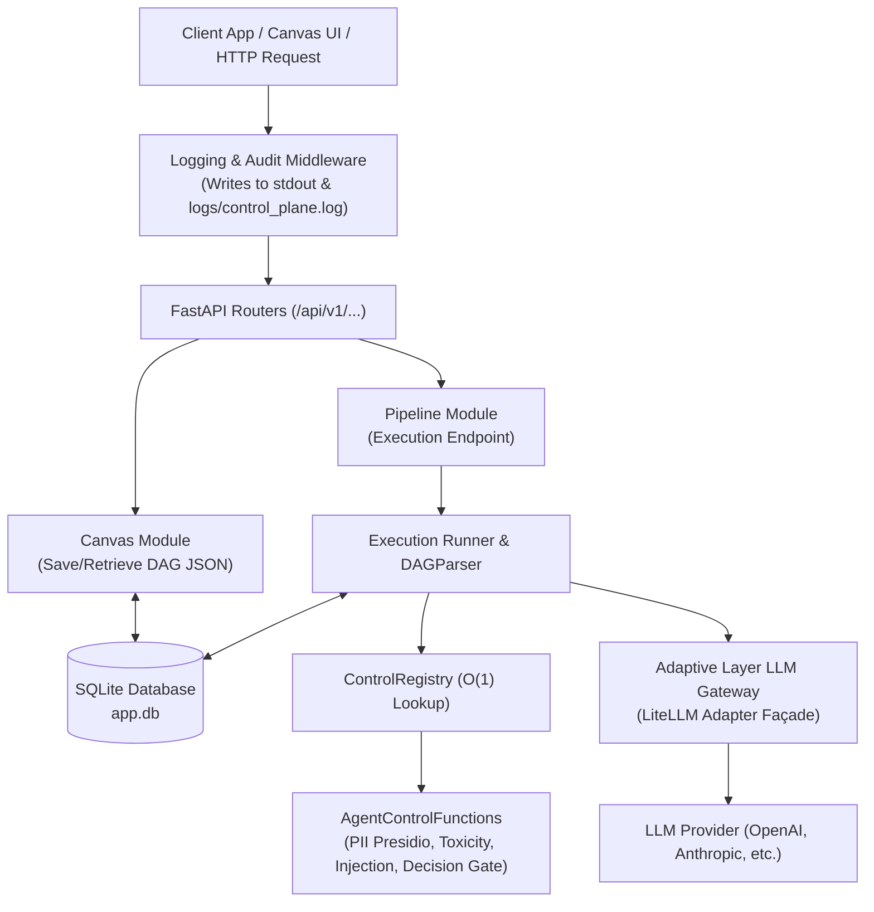

# AI Control Panel - Backend API Architecture & Beginner Walkthrough

Welcome to the **AI Control Panel Backend**! This document explains how the entire FastAPI server works step-by-step in clear, simple terms. Whether you are a beginner ("noob") or an experienced developer, this walkthrough will give you a complete understanding of how our system executes AI pipelines, enforces security guardrails, logs audit data, and routes requests to LLM models.

---

## 1. High-Level Architecture Diagram



---

## 2. API Folder Structure

Here is how the backend codebase is organized inside `API/app/`:

```text
API/
├── app/
│   ├── main.py                          # Main FastAPI application entrypoint & seed data
│   ├── core/                            # System settings, Database setup, Logging
│   │   ├── config.py                    # Environment variables & constants
│   │   ├── database.py                  # SQLAlchemy engine & SQLite session
│   │   ├── logger_config.py             # File logging config (writes to logs/control_plane.log)
│   │   └── logging_middleware.py        # HTTP audit logging middleware
│   ├── adaptive_layer/                  # Façade layer for external LLM Gateways
│   │   └── llm_gateway/                 # LiteLLM adapter & key generation
│   ├── execution_engine/                # Graph Traversal Engine
│   │   ├── dag_parser.py                # Parses React Flow nodes & edges into Adjacency Map
│   │   └── runner.py                    # Traverses nodes, dispatches controls & enqueues branches
│   ├── AgentControlFunctions/           # Pluggable security & routing control functions
│   │   ├── context.py                   # Mutable PipelineContext passed down the graph
│   │   ├── registry.py                  # O(1) ControlRegistry & @register_control decorator
│   │   ├── guardrails/                  # PII, Toxicity, Prompt Injection filters
│   │   ├── routing/                     # Semantic Router & Decision Gate
│   │   └── sandboxing/                  # Firecracker isolated microVM tool sandbox
│   └── modules/                         # Feature domain endpoints (Projects, Canvas, Pipeline, etc.)
│       ├── projects/                    # Projects & Agents CRUD endpoints
│       ├── canvas/                      # Save and retrieve React Flow DAG JSON
│       └── pipeline/                    # Pipeline execution endpoint (/invoke/{id})
└── logs/
    └── control_plane.log                # Persistent log file containing all API calls & payloads
```

---

## 3. Core Concepts & How They Work

### A. The Database (`SQLite` + `SQLAlchemy`)
We use SQLite (`app.db`) for database storage. It holds three main tables:
1. **`projects`**: Workspace environments (e.g. `"Enterprise AI Core"`).
2. **`agents`**: Individual AI agents (e.g. `"Customer Support Agent"`) with their own API keys and budgets.
3. **`pipelines`**: Stores the canvas DAG JSON (`canvas_json`) containing the exact nodes and edges drawn in the UI.

### B. The Adaptive Layer LLM Gateway Façade
To prevent our routers from depending directly on third-party libraries (like `LiteLLM`), we use an **Adaptive Layer Façade**:
- `get_llm_gateway()` returns an instance of `LLMGatewayProvider`.
- It dynamically generates agent keys (`generate_agent_key()`) and sends prompt completions to LLMs securely.

### C. The Graph Execution Engine (`dag_parser.py` & `runner.py`)
When you send a prompt to `/api/v1/pipeline/invoke/{pipeline_id}`:
1. **`DAGParser`**:
   - Reads the saved `nodes` and `edges` JSON from SQLite.
   - Builds an **Adjacency Map** (a directional graph map of which node connects to which node).
   - Finds the **Start Node** (`node_prompt_start`).
2. **`ExecutionRunner`**:
   - Creates a `PipelineContext` holding the prompt.
   - Uses a **Queue-Based Loop** to traverse nodes.
   - Supports **Single-Path Decisions** (choosing 1 branch) and **Multi-Path Fan-Out** (running parallel branches simultaneously).

### D. The Pluggable Control Registry (`ControlRegistry`)
Instead of long `if / elif` chains, we use an **$O(1)$ Registry Pattern**:
```python
@register_control(["presidio_analyzer", "pii_presidio", "ctrl_pii_masking"])
def execute_pii_presidio(ctx: PipelineContext, node_config: Dict[str, Any]):
    ...
```
When `runner.py` encounters any node engine string, it performs a $O(1)$ hash map lookup: `ControlRegistry.get_control(engine)`. If found, it executes the control immediately.

### E. Persistent Logging & Audit System (`logs/control_plane.log`)
- All server logs write simultaneously to **Console (stdout)** and to **`logs/control_plane.log`** using a `RotatingFileHandler`.
- `RequestResponseLoggingMiddleware` logs:
  - Every API request method, path, client IP, and input payload JSON.
  - Every API response status code, latency (ms), and output response JSON.

---

## 4. End-to-End Execution Walkthrough Example

Let's walk through what happens when a client sends a request to execute a pipeline:

```bash
curl -X POST "http://localhost:8000/api/v1/pipeline/invoke/89626819-b2ce-459f-86ff-dfc0d0693923" \
  -H "Content-Type: application/json" \
  -d '{"prompt": "Hello, my email is john@acme.com and SSN is 000-12-3456"}'
```

### Step 1: Audit Logging Middleware Triggers
`RequestResponseLoggingMiddleware` intercepts the request and logs:
```text
[INFO] [control_plane.audit]: --> [API REQ] POST /api/v1/pipeline/invoke/89626819... | Payload: {"prompt":"Hello, my email is john@acme.com..."}
```

### Step 2: Pipeline Router Lookup
The router fetches the pipeline record from SQLite by ID `89626819...` and passes its `canvas_json` to `ExecutionRunner`.

### Step 3: Node Traversal & Control Execution
1. **Node 1: `node_prompt_start` (System Prompt)**
   - Ingests raw prompt `"Hello, my email is john@acme.com..."`.
   - Records span `sp_..._1`.
2. **Node 2: `node_ctrl_pii_masking` (PII Presidio Analyzer)**
   - `ControlRegistry.get_control("ctrl_pii_masking")` looks up `execute_pii_presidio`.
   - Redacts `john@acme.com` ➔ `[REDACTED_EMAIL]` and `000-12-3456` ➔ `[REDACTED_SSN]`.
   - Sets `ctx.taint_flags = ["PII_DETECTED"]`.
3. **Node 3: `node_ctrl_decision_gate` (Decision Gate)**
   - `ControlRegistry` invokes `execute_decision_gate`.
   - Evaluates policy: Since PII redaction succeeded, sets `ctx.last_evaluated_output_port = "out_pass"`.
4. **Node 4: `node_term_allow` (Allowed to LLM)**
   - Invokes LiteLLM Gateway with clean prompt `"Hello, my email is [REDACTED_EMAIL]..."`.
   - Appends gateway completion to `ctx.final_output`.

### Step 4: Output Response & Log Completion
The API returns a 200 OK response with the sanitized prompt, taint flags, and telemetry spans. The middleware logs:
```text
[INFO] [control_plane.audit]: <-- [API RES] POST /api/v1/pipeline/invoke/89626819... | Status: 200 | Duration: 18.2ms | Output: {"status":"passed","action_taken":"Allow"...}
```

---

## 5. How to Add a New Control Node (Developer Guide)

To add a new control function (for example, a **Regex Masker** or **Hallucination Evaluator**):

1. **Create a new file in `API/app/AgentControlFunctions/guardrails/`** (or `routing/`):
```python
# API/app/AgentControlFunctions/guardrails/regex_masker.py
import time
from typing import Dict, Any
from app.AgentControlFunctions.context import PipelineContext
from app.AgentControlFunctions.registry import register_control

@register_control(["regex_masker", "ctrl_regex_masker"])
def execute_regex_masker(ctx: PipelineContext, node_config: Dict[str, Any]) -> PipelineContext:
    pattern = node_config.get("regex_pattern", r"\d+")
    text = ctx.sanitized_prompt_object.get("prompt", "")
    # Apply transformation...
    ctx.sanitized_prompt_object["prompt"] = text
    return ctx
```

2. **Import the module in `API/app/AgentControlFunctions/__init__.py`**:
```python
from app.AgentControlFunctions.guardrails import regex_masker
```

That's it! Your new control node is now automatically registered in `ControlRegistry` and ready to execute in any pipeline canvas DAG!
