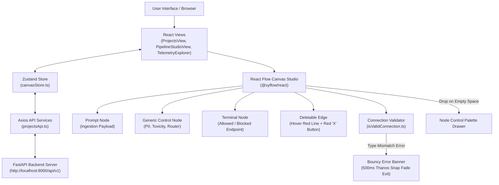
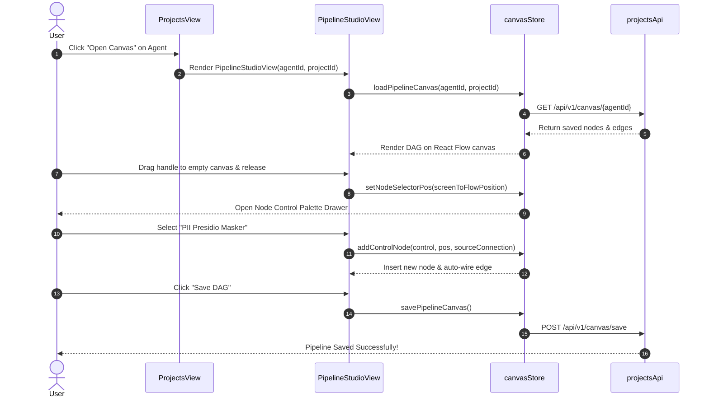

# AI Control Panel - UI Architecture & Beginner Walkthrough

Welcome to the **AI Control Panel Frontend**! This document explains how the React + Vite + TypeScript user interface operates in simple, easy-to-understand terms. Whether you are new to React Flow or an experienced frontend engineer, this walkthrough will give you a complete understanding of our canvas DAG studio, node palette, connection validation, state management, and backend synchronization.

---

## 1. High-Level UI Architecture Diagram



---

## 2. UI Folder Structure

Here is how the frontend codebase is organized inside `UI/src/`:

```text
UI/
├── src/
│   ├── api/                             # Live Backend Integration
│   │   ├── apiClient.ts                 # Axios instance with base URL & interceptors
│   │   └── services/
│   │       └── projectsApi.ts           # Service for Projects, Agents, Canvas & Invoke calls
│   ├── components/
│   │   ├── canvas/                      # React Flow Nodes, Edges & Controls
│   │   │   ├── PromptNode.tsx           # Ingestion Prompt Node & Terminal Node
│   │   │   ├── GenericControlNode.tsx   # Universal Control Node (Guardrails & Routers)
│   │   │   ├── DeletableEdge.tsx        # Edge with hover red line & 'X' delete button
│   │   │   ├── NodePaletteDrawer.tsx    # Slide-over control palette drawer
│   │   │   └── TopNavigationHeader.tsx  # Canvas top toolbar with Save DAG button
│   ├── helpers/
│   │   └── isValidConnection.ts         # Handle-to-handle connection & type compatibility validator
│   ├── store/
│   │   ├── canvasStore.ts               # Zustand store managing nodes, edges, loading & saving
│   │   ├── projectsStore.ts             # Projects & Agents workspace state
│   │   └── themeStore.ts                # Dark/Light theme mode state
│   ├── views/
│   │   ├── PipelineStudioView.tsx       # Main Drag-and-Drop Canvas View
│   │   ├── ProjectsView.tsx             # Workspace & Agent management grid
│   │   └── TelemetryExplorerView.tsx    # Live trace logs & observability viewer
│   ├── App.tsx                          # Root application layout & view routing
│   └── main.tsx                         # React 18 DOM entrypoint
```

---

## 3. Core Frontend Features & How They Work

### A. Live Backend Data Binding (No Mocks!)
All data operations connect directly to the FastAPI backend:
- **Loading Canvas**: Opening an agent calls `GET /api/v1/canvas/{pipeline_id}` via [`projectsApi.ts`](file:///Users/amitkumardey/Workspace/Projects/AIControlPanel/UI/src/api/services/projectsApi.ts). If a saved pipeline exists in SQLite, it loads into React Flow; otherwise, it presents the clean initial template canvas.
- **Saving Canvas**: Clicking **Save DAG** calls `POST /api/v1/canvas/save`, persisting `pipeline_id`, `project_id`, `agent_id`, `name`, `nodes`, and `edges` directly into SQLite.

### B. Zustand State Management (`canvasStore.ts`)
We use **Zustand** for fast, central state management:
- `nodes: Node[]` – Stores node IDs, positions, types, and control configuration values.
- `edges: Edge[]` – Stores wire connections (`source`, `sourceHandle`, `target`, `targetHandle`).
- `loadPipelineCanvas()` – Fetches DAG from API and sanitizes node positions so no undefined errors occur.
- `savePipelineCanvas()` – Bundles nodes & edges and sends them to the backend database.

### C. Custom React Flow Nodes
1. **`PromptNode`** ([`PromptNode.tsx`](file:///Users/amitkumardey/Workspace/Projects/AIControlPanel/UI/src/components/canvas/PromptNode.tsx)):
   - Represents the input payload ingestion point (System Prompt).
   - Features a quick `+` button on its output port to spawn downstream nodes.
2. **`GenericControlNode`** ([`GenericControlNode.tsx`](file:///Users/amitkumardey/Workspace/Projects/AIControlPanel/UI/src/components/canvas/GenericControlNode.tsx)):
   - Renders any control (PII Presidio, Toxicity Guard, Semantic Router, Decision Gate).
   - Dynamically calculates handle heights for single or multi-output ports.
3. **`TerminalNode`** ([`PromptNode.tsx`](file:///Users/amitkumardey/Workspace/Projects/AIControlPanel/UI/src/components/canvas/PromptNode.tsx#L94-L160)):
   - Represents pipeline endpoints (`Allowed to LLM` vs `Blocked / Security Violation`).

### D. Edge Hover & Delete Interaction (`DeletableEdge.tsx`)
- Hovering over a wire turns the line vibrant red (`#ef4444`) and renders a central red `X` delete button.
- Clicking the `X` button deletes that specific edge. Normal clicking on wires does **not** accidentally delete edges.

### E. Connection Validation (`isValidConnection.ts`)
When dragging a wire between handles, `isValidConnection` checks data type compatibility:
- Prompt payload ➔ Guardrail input (`prompt_object` ➔ `prompt_object`) = **Valid (Green Wire)**.
- Incompatible types = **Invalid (Red Wire + Bouncy Error Banner)**.

### F. Bouncy Type Mismatch Banner with Thanos Snap Exit
When an invalid connection is attempted:
1. A bouncy top-center alert banner appears displaying the exact type error (e.g. *"Cannot connect prompt_object to scalar_number"*).
2. After 3 seconds, it triggers a smooth **500ms drift-and-fade exit transition** ("Thanos snap" effect) before disappearing cleanly.

### G. Drag Connection Drop to Palette
If you drag a wire from a handle and release it on empty canvas space:
1. `onConnectEnd` calculates the exact canvas drop position using `screenToFlowPosition`.
2. Opens the **Node Control Palette Drawer** at that exact location.
3. Selecting a control automatically inserts the node and wires it to the originating handle with smart auto-alignment!

---

## 4. Step-by-Step User Flow Walkthrough



---

## 5. Developer Guide: How to Add a New UI Node or Control

1. **Add Control Definition to Category Array** in [`src/components/canvas/NodePaletteDrawer.tsx`](file:///Users/amitkumardey/Workspace/Projects/AIControlPanel/UI/src/components/canvas/NodePaletteDrawer.tsx):
```typescript
{
  id: 'regex_masker',
  name: 'Regex Masker',
  description: 'Mask custom regex patterns',
  category: 'guardrail',
  ports: {
    inputs: [{ id: 'in_regex_prompt', label: 'Prompt Input', type: 'prompt_object' }],
    outputs: [{ id: 'out_regex_pass', label: 'Sanitized Output', type: 'sanitized_prompt_object' }]
  }
}
```

2. **Add Port Type Rule** in [`src/helpers/isValidConnection.ts`](file:///Users/amitkumardey/Workspace/Projects/AIControlPanel/UI/src/helpers/isValidConnection.ts) if creating a new data type.

The `GenericControlNode` component will automatically render your new control, compute its handles, and support drag-drop placement seamlessly!
