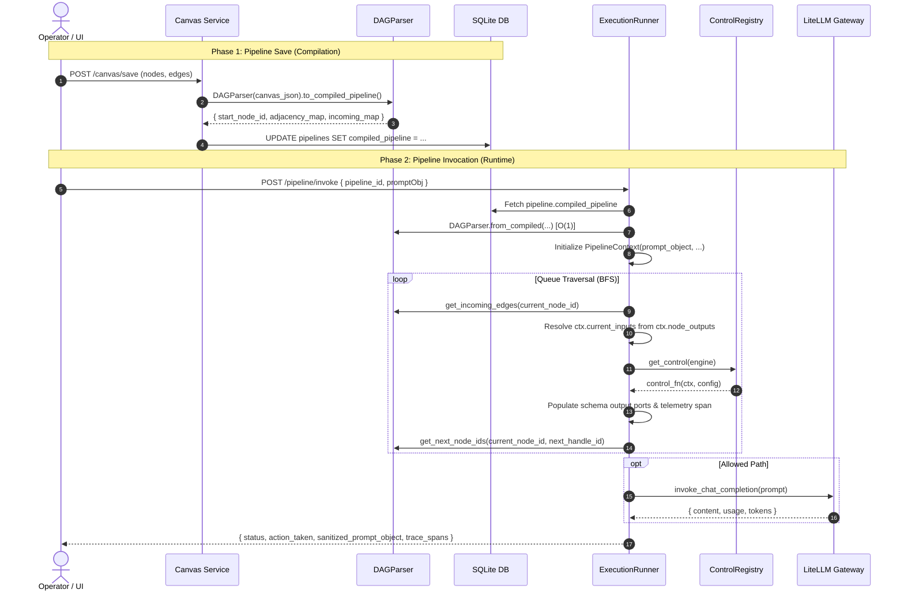

# Execution Engine Architecture & Runtime Specification

This document provides a comprehensive technical breakdown of how the **AI Control Panel Execution Engine** compiles, traverses, and executes directed acyclic graph (DAG) pipelines designed on the React Flow canvas.

---

## 1. Core Design Principles

1. **Strict Fail-Closed Security Policy**:
   If an evaluation model (e.g., Presidio PII, Detoxify, DeBERTa Prompt Injection) throws an unhandled exception or is offline, execution halts immediately (`status: "blocked"`, `action_taken: "Halt"`) to prevent exposing un-sanitized or hostile prompts to downstream LLMs.

2. **Sub-Millisecond Pre-Compilation ($O(1)$ Lookup)**:
   The visual React Flow DAG is pre-compiled at **Save Time** into bi-directional index maps stored in the database (`compiled_pipeline` column). Runtime invocation performs **zero canvas parsing**.

3. **Schema-Driven Dynamic Port Binding**:
   Nodes do not hardcode upstream node names or magic global variables. When an edge connects `node_A:out_pass` $\to$ `node_B:in_eval`, the engine automatically extracts the output payload from `node_A` and injects it into `node_B`'s `current_inputs["in_eval"]`.

---

## 2. The Two-Phase Pipeline Lifecycle



---

## 3. Detailed Component Breakdown

### A. Graph Compilation (`DAGParser`)

Located at `API/modules/pipeline/engine/dag_parser.py`.

When the operator saves a pipeline canvas, `DAGParser` processes the React Flow JSON into two dual-index adjacency maps:

1. **Forward Adjacency Map (`adjacency_map`)**:
   Answers: *"Given `node_A` and an activated handle `out_pass`, which nodes should execute next?"*
   ```json
   {
     "node_toxicity": [
       { "target": "node_decision_gate", "sourceHandle": "out_pass", "targetHandle": "in_eval" },
       { "target": "node_alert_logger", "sourceHandle": "out_toxic", "targetHandle": "in_alert" }
     ]
   }
   ```

2. **Reverse Incoming Map (`incoming_map`)**:
   Answers: *"Given `node_decision_gate`, which upstream nodes and output ports feed data into it?"*
   ```json
   {
     "node_decision_gate": [
       { "source": "node_toxicity", "sourceHandle": "out_pass", "targetHandle": "in_eval" }
     ]
   }
   ```

3. **Start Node Resolution (`find_start_node_id`)**:
   Locates the root entrypoint:
   - Primary: Looks for node type `prompt`, `ingestion`, `start`, or `controlId == "ingestion_node"`.
   - Secondary: Looks for any node with in-degree equal to 0 (no incoming edges).

---

### B. Execution Context (`PipelineContext`)

Located at `API/AgentControlFunctions/context.py`.

The `PipelineContext` is the shared mutable state bus flowing through the execution graph:

| Field | Type | Purpose |
| :--- | :--- | :--- |
| `prompt_object` | `Dict[str, Any]` | The original immutable request payload (`{"prompt": "..."}`). |
| `sanitized_prompt_object` | `Dict[str, Any]` | The mutated prompt text after secrets/PII redactions or optimizations. |
| `taint_flags` | `List[str]` | Security marker flags accumulated across nodes (`"TOXICITY_FLAG"`, `"PII_DETECTED"`). |
| `current_inputs` | `Dict[str, Any]` | Dynamic inputs arriving on ports for the currently executing node. |
| `node_outputs` | `Dict[str, Any]` | Registry of outputs produced by every completed node (`node_outputs[node_id][port_id]`). |
| `spans` | `List[Dict]` | OpenTelemetry-style performance and audit records per node. |

#### Helper Methods:
- `ctx.get_input(port_name="in_payload")`: Returns the value arriving on `port_name` (or falls back to `sanitized_prompt_object` / `prompt_object`).
- `ctx.get_input_prompt()`: Extracts raw prompt string from `current_inputs` or context.
- `ctx.set_output(port_name, payload)`: Stores a named output payload on `node_outputs[current_node_id][port_name]`.

---

### C. Execution Engine & Traversal Loop (`ExecutionRunner`)

Located at `API/modules/pipeline/engine/runner.py`.

#### Step-by-Step Node Execution Cycle:

```
[Queue Pop: current_node_id]
             │
             ▼
1. Dynamic Input Resolution:
   - Read parser.get_incoming_edges(current_node_id)
   - For each edge: fetch ctx.node_outputs[edge.source][edge.sourceHandle]
   - Assign to ctx.current_inputs[edge.targetHandle]
             │
             ▼
2. Control Function Dispatch:
   - control_fn = ControlRegistry.get_control(engine)
   - control_fn(ctx, configValues)
             │
             ▼
3. Schema-Driven Output Population:
   - Read declared outputs: control.ports.outputs
   - Populate output ports based on status (passed vs blocked)
             │
             ▼
4. Telemetry Span Recording:
   - Record duration_ms, status, action_taken, metadata snapshot
             │
             ▼
5. Next Node Resolution:
   - next_handle = ctx.metadata.get("next_handle_id")
   - next_node_ids = parser.get_next_node_ids(current_node_id, handle_id=next_handle)
   - Push unvisited next_node_ids to queue
```

---

## 4. Node Dispatch via `ControlRegistry`

Located at `API/AgentControlFunctions/registry.py`.

Control functions are discovered at startup and registered in an in-memory dictionary using the `@register_control` decorator:

```python
@register_control(["detoxify", "detoxify_classifier"])
def execute_toxicity_detoxify(ctx: PipelineContext, node_config: Dict[str, Any]) -> PipelineContext:
    text = ctx.get_input_prompt("in_text")
    # ... evaluate toxicity ...
```

---

## 5. Trace Span Output Structure

Every invocation produces a detailed execution summary returned to the client and stored for observability:

```json
{
  "pipeline_id": "0ece2728-18e8-4481-87fb-4be5e122ff4e",
  "status": "mutated",
  "action_taken": "Redact",
  "sanitized_prompt_object": {
    "prompt": "Contact <EMAIL_ADDRESS> with AWS key [REDACTED_AWS_KEY]..."
  },
  "execution_duration_ms": 314.8,
  "trace_spans": [
    {
      "node_id": "node_prompt_start",
      "node_label": "System Prompt",
      "status": "passed",
      "duration_ms": 0.05
    },
    {
      "node_id": "node_ctrl_secret_scanner",
      "node_label": "Secret Scanner",
      "status": "mutated",
      "action_taken": "Redact",
      "duration_ms": 1.25
    },
    {
      "node_id": "node_ctrl_pii_masking",
      "node_label": "Presidio PII Masking",
      "status": "mutated",
      "action_taken": "Redact",
      "duration_ms": 4.12
    },
    {
      "node_id": "node_ctrl_toxicity_checker",
      "node_label": "Toxicity Moderation",
      "status": "passed",
      "duration_ms": 18.3
    },
    {
      "node_id": "node_ctrl_decision_gate",
      "node_label": "Decision Gate",
      "status": "passed",
      "duration_ms": 0.12
    },
    {
      "node_id": "node_term_allow",
      "node_label": "Allowed to LLM",
      "status": "passed",
      "duration_ms": 288.4
    }
  ]
}
```
